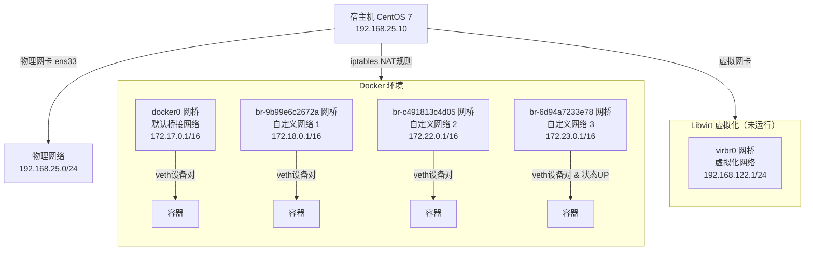

# 1. 

好的，我们来全面解读一下您 CentOS 7 Docker 环境下的网络配置。这是一个非常典型的结构，包含了主机物理网络、虚拟化网络和容器网络。

为了让您有一个全局的认识，下图清晰地展示了这些网络接口之间的关系和数据流向：



---

### 🔍 各网络接口详细解读 (基于 `ip addr` 输出)

现在我们根据上图，对每个接口进行详细解读。

#### **1. `lo` - 回环接口 (Loopback Interface)**
*   **作用**: 这是一个虚拟网络接口，用于**本机内部通信**。所有发送到 `127.0.0.1` 的数据包都会立刻被本机接收，不经过任何物理网络。用于测试网络协议栈是否正常工作，以及访问本机运行的网络服务（如数据库、Web服务器）。
*   **地址**: `127.0.0.1/8` (IPv4) 和 `::1/128` (IPv6)。`/8` 表示子网掩码为 `255.0.0.0`，整个 `127.x.x.x` 的地址都指向本机。
*   **状态**: `state UNKNOWN` (对于 `lo` 是正常状态)。

#### **2. `ens33` - 物理以太网接口**
*   **作用**: 这是宿主机的**物理网卡**，连接外部真实网络（如你的路由器/交换机），是宿主机与外界通信的主要通道。
*   **地址**: `192.168.25.10/24`
    *   **宿主机地址**: 这就是你的 CentOS 系统的 IP 地址。
    *   **网段**: `192.168.25.0/24`
    *   **子网掩码**: `/24` 对应 `255.255.255.0`，表示这个网络中最多可以有 254 个主机（从 `192.168.25.1` 到 `192.168.25.254`）。
    *   **广播地址**: `192.168.25.255`
*   **MAC 地址**: `00:0c:29:cd:47:91` (物理硬件地址)。

#### **3. `virbr0` 和 `virbr0-nic` - Libvirt 虚拟化网桥**
*   **作用**: 这是由 `libvirtd`（通常用于管理 KVM 虚拟机）**自动创建的虚拟网桥**，为虚拟机提供 NAT 网络功能。`virbr0-nic` 是一个虚拟网卡，作为 `virbr0` 的端口，通常可以忽略。
*   **地址**: `192.168.122.1/24`。Libvirt 会充当这个局域网的网关，并为启动的虚拟机分配 `192.168.122.x` 的 IP。
*   **状态**: `state DOWN` 和 `NO-CARRIER` 表明**当前没有运行的虚拟机**使用这个网络。

#### **4. `docker0` - Docker 默认网桥**
*   **作用**: 这是 Docker **默认创建的网桥**。所有未指定自定义网络的 Docker 容器都会连接到这个网桥。它通过 **NAT（网络地址转换）** 的方式让容器访问外网，也通过 **端口映射** (`-p 80:80`) 让外界访问容器服务。
*   **地址**: `172.17.0.1/16`
    *   **网关地址**: 对于连接在 `docker0` 上的容器来说，这个 IP 就是它们的默认网关。
    *   **网段**: `172.17.0.0/16`，子网掩码 `255.255.0.0`，理论上可容纳 65534 个容器（实际受 Docker 配置限制）。

#### **5. `br-xxxxxx` - Docker 自定义网桥**
*   **作用**: 当你使用 `docker network create` 或 Docker Compose 创建**自定义网络**时，Docker 就会生成一个这样的网桥（名称是随机哈希值）。每个自定义网络都是独立的，提供了更好的隔离性和DNS自动发现功能（容器间可以通过容器名通信）。
*   **地址**:
    *   `br-9b99e6c2672a`: `172.18.0.1/16`
    *   `br-c491813c4d05`: `172.22.0.1/16` (状态DOWN，未使用)
    *   `br-6d94a7233e78`: `172.23.0.1/16` (状态UP，正在使用)
*   **状态**: 只有 `br-6d94a7233e78` 是 `state UP`，说明**当前有容器正在使用这个自定义网络**。其他为 `DOWN` 的可能是因为没有容器运行在其中。

#### **6. `vethc2ea41c@if84` - 虚拟以太网设备对**
*   **作用**: **这是容器网络通信的关键！** `veth` 设备总是成对出现，像一根虚拟的网线。
    *   一端 (`vethc2ea41c`) 在**宿主机**的命名空间中，并连接在某个网桥（这里是 `br-6d94a7233e78`) 上，作为网桥的一个端口。
    *   另一端 (`if84`) 在**容器**的网络命名空间中，显示为容器内的 `eth0` 网卡。
*   **数据流**: 容器 `eth0` <-> `veth` 设备对 <-> Docker 网桥 <-> 宿主机 `ens33` <-> 外网。
*   **状态**: `state UP` 表明链路通畅。

---

### 📊 核心概念与维度总结

| 概念 | 解释 | 在示例中的体现 | 允许范围/用途 |
| :--- | :--- | :--- | :--- |
| **宿主机地址** | 物理服务器在局域网中的IP | `192.168.25.10` | 由路由器DHCP分配或手动配置，是SSH管理的地址。 |
| **局部网络** | 一个逻辑上的网络划分，通常是私有IP段 | `192.168.25.0/24`, `172.17.0.0/16` | `10.0.0.0/8`, `172.16.0.0/12`, `192.168.0.0/16` |
| **网桥** | 虚拟网络交换机，用于连接多个网络段 | `docker0`, `br-xxxxxx`, `virbr0` | Docker自动创建或用户自定义，实现容器间及对外的通信。 |
| **网段** | 一个网络的范围，由IP和子网掩码定义 | `172.17.0.0/16` | 由网络管理员规划，避免IP冲突。Docker默认从`172.17.0.0/16`开始创建新网络。 |
| **子网掩码** | 定义IP地址中哪些位是网络位，哪些是主机位 | `/24` (`255.255.255.0`), `/16` (`255.255.0.0`) | `/<1-32>`，越小网络规模越大。`/24`有254主机，`/16`有65534主机。 |
| **网卡** | 网络接口卡，物理或虚拟的网络接口 | `ens33`(物理), `docker0`(虚拟), `vethxxx`(虚拟) | 物理网卡数量有限，虚拟网卡由系统按需创建，数量可很多。 |
| **veth 设备对** | 虚拟以太网电缆，连接命名空间和网桥 | `vethc2ea41c@if84` | 每启动一个容器（使用桥接网络）就会创建一对，是容器流量的出入口。 |

### 💡 总结与用途

*   **宿主机**通过 `ens33` 与你的局域网和互联网通信。
*   **Docker 容器**通过 `veth` pair连接到各种**网桥**（`docker0` 或 `br-xxx`）。
*   网桥充当虚拟交换机，**隔离了容器网络和主机物理网络**。
*   容器要访问外网时，数据包通过网桥送到宿主机，由宿主机通过 **iptables NAT 规则**进行源地址转换后，再从 `ens33` 发出。
*   外部要访问容器时，需要通过 `-p` 参数做**端口映射**，Docker 也会通过 iptables 的 DNAT 规则将到达宿主机特定端口的流量转发到对应容器。

这种架构使得容器可以获得一个私有IP，并与同一网桥下的其他容器直接通信，同时又能通过宿主机安全地访问外部世界，外部世界也能通过端口映射访问到容器内的服务。

# 2. 

好的，我们来详细解读一下这个 Windows 系统的网络配置，并理清从公网到虚拟机 CentOS 7 的完整网络路径。

为了让您对整个网络架构有一个全局的、直观的认识，我绘制了下面这张网络拓扑图，它清晰地展示了数据从公网到虚拟机的完整流向：

```mermaid
flowchart TD
A[互联网 Internet]
R[无线路由器/网关<br>WAN口: 运营商分配的公网IP<br>LAN口: 192.168.0.1/24<br>功能: NAT, DHCP, WiFi]

subgraph WinHost[Windows 宿主机]
    WLAN[无线网卡 WLAN<br>DHCP获取地址: 192.168.0.107]
    
    subgraph VMware[VMware 虚拟化平台]
        VMNET1[虚拟网卡 VMnet1<br>Host-Only 网关<br>192.168.10.1/24]
        VMNET8[虚拟网卡 VMnet8<br>NAT 模式网关<br>192.168.25.1/24]
    end

    CentOSVM[CentOS 7 虚拟机<br>ens33: 192.168.25.128/24<br>网关: 192.168.25.2(VMNET8)<br>DNS: Windows Host]
end

A -- 光纤/网线 --> R
R -- WiFi无线连接 --> WLAN

WLAN -- 物理连接 --> VMware
VMNET8 -- 虚拟交换 --o CentOSVM
```

---

### 🔍 各网络适配器详细解读 (基于 `ipconfig` 输出)

现在我们根据上图，对每个接口进行详细解读。

#### **1. 无线局域网适配器 WLAN**
*   **真实存在吗？** **是**。这是你电脑内置的**物理无线网卡**。
*   **作用**: 负责通过 WiFi 连接到你所在局域网的**无线路由器**，是你电脑访问互联网的主要通道。
*   **地址分配**:
    *   **IPv4 地址 . . . : 192.168.0.107**: 这是你的 Windows 主机在当前局域网中的 **私有IP地址**。
    *   **子网掩码 . . . : 255.255.255.0**: 表示局域网网段是 `192.168.0.0/24`，最多容纳 254 台设备。
    *   **默认网关 . . . : 192.168.0.1**: 这就是你**无线路由器的局域网IP地址**。所有发往外网的数据包都先发到这里。
*   **分配方式**: 通常由路由器的 **DHCP 服务**自动分配。你的电脑连上 WiFi 后，会广播一个 DHCP 请求，路由器收到后从其地址池（如 `192.168.0.2` ~ `192.168.0.254`）中选择一个空闲 IP 分配给它，并同时告知网关和 DNS 服务器地址。
*   **用途**: **让 Windows 宿主机能够访问互联网和局域网其他设备。**

#### **2. 以太网适配器 VMware Network Adapter VMnet8**
*   **真实存在吗？** **是，但它是虚拟的**。这是 VMware Workstation 或 Player 安装时创建的**虚拟网卡**。
*   **作用**: 这是 **NAT 模式网络** 的网关网卡。
    *   它为使用 NAT 模式的虚拟机（如你的 CentOS 7）提供一个私有网络段 (`192.168.25.0/24`)。
    *   它自身充当这个私有网络的网关（通常是 `192.168.25.2`，但这里显示为 `.1`，VMware 可能会稍有调整）。
    *   **它负责将虚拟机的网络请求进行 NAT 转换后，通过主机的物理网卡（如 WLAN）发送出去，并将返回的数据包再转给相应的虚拟机。** 这正是上图中“NAT转换”所描述的过程。
*   **地址**: `192.168.25.1`。这个地址是固定的，由 VMware 软件设定。
*   **用途**: **让虚拟机可以通过宿主机的网络连接上网（出公网），同时外界无法直接访问虚拟机，安全性较好。** 这是最常用的模式。

#### **3. 以太网适配器 VMware Network Adapter VMnet1**
*   **真实存在吗？** **是，虚拟的**。同样是 VMware 创建的虚拟网卡。
*   **作用**: 这是 **Host-Only (仅主机) 模式网络** 的网关网卡。
    *   它创建了一个完全封闭的私有网络 (`192.168.10.0/24`)。
    *   这个网络**只允许虚拟机和 Windows 宿主机之间相互通信**，虚拟机**无法通过它访问互联网**。
*   **地址**: `192.168.10.1`。
*   **用途**: **用于构建一个隔离的测试环境，保证虚拟机只与宿主机通信，不与外部网络有任何接触。**

#### **4. & 5. 无线局域网适配器 本地连接* 3 和 *4 / 蓝牙网络连接**
*   **真实存在吗？** **部分是虚拟的，部分是物理的**。这些通常是系统或应用程序（如手机共享热点、VPN 客户端、虚拟串口等）创建的临时或虚拟适配器。
*   **状态**: `媒体已断开连接` 表示该网卡没有激活或没有插入网线。
*   **其中一个活动 (`本地连接* 4`)**:
    *   地址 `192.168.137.1` 非常典型，这通常是 **Windows 的“移动热点”功能**开启后创建的虚拟网卡。当你将电脑的移动网络或 WiFi 共享出去时，Windows 会创建一个使用 `192.168.137.0/24` 网段的新网络，自己充当网关 (`192.168.137.1`)。

---

### 📊 核心概念与维度总结

| 概念 | 解释 | 在示例中的体现 | 数量范围/用途 |
| :--- | :--- | :--- | :--- |
| **物理网卡** | 硬件设备，如以太网卡、无线网卡 | `WLAN`, `蓝牙网络连接` | 通常1-2个，是真实存在的硬件。 |
| **虚拟网卡** | 由软件模拟的网卡 | `VMnet1`, `VMnet8`, `本地连接* 3/4` | 由软件创建和管理，数量可很多。用于虚拟化、VPN、网络隧道等。 |
| **DHCP** | 动态主机配置协议，自动分配IP | 路由器给 `WLAN` 分配 `192.168.0.107` | 简化网络管理，避免手动配置IP的麻烦和冲突。 |
| **NAT** | 网络地址转换 | `VMnet8` 将虚拟机网络 `192.168.25.0/24` 转换后通过 `WLAN` 上网 | 让使用私有IP的设备可以共享一个公网IP访问互联网。是家用网络和虚拟机上网的核心。 |
| **网关** | 网络出口的“大门” | `192.168.0.1` (路由器), `192.168.25.1` (`VMnet8`) | 数据包要去往其他网络（如互联网），必须发送给网关设备。 |
| **子网掩码** | 定义IP地址的网络部分和主机部分 | `255.255.255.0` (/24) | 用来判断目标IP是否在同一局域网内。 |
| **NAT 模式** | 虚拟机网络模式之一 | `VMnet8` 适配器 | **最佳上网模式**。虚拟机可访问外网，外网不能直接访问虚拟机，安全方便。 |
| **Host-Only 模式** | 虚拟机网络模式之一 | `VMnet1` 适配器 | **完全隔离模式**。虚拟机与宿主机组成一个封闭内网，不与外界通信，用于安全测试。 |
| **桥接模式** | 虚拟机网络模式之一 | 在此输出中未体现 | 虚拟机会直接连接到物理网络，像一台**独立的真实主机**一样，从路由器DHCP获取和宿主机同网段的IP（如 `192.168.0.108`）。 |

### 💡 总结与数据流

**公网 → CentOS 7 虚拟机的完整路径：**

1.  **分配地址**: 你的无线路由器通过 **DHCP** 为 Windows 主机的 **物理网卡 (WLAN)** 分配了地址 `192.168.0.107`。
2.  **创建虚拟网络**: VMware 创建了 **虚拟网卡 (VMnet8)**，地址为 `192.168.25.1`，它定义了一个新的私有网段 (`192.168.25.0/24`)。
3.  **虚拟机获取地址**: 当你启动 CentOS 7 虚拟机并将其网络模式设置为 **NAT** 时，VMware 内置的 DHCP 服务会为虚拟机的网卡分配一个地址，例如 `192.168.25.128`，并告知其网关是 `192.168.25.2` (或 `.1`)。
4.  **上网过程**:
    *   虚拟机要访问公网（如 `8.8.8.8`），数据包发送给网关 `192.168.25.2` (即 `VMnet8` 虚拟网卡)。
    *   VMware 的 **NAT 服务** 将数据包的源地址从 `192.168.25.128` **转换**为 Windows 主机的地址 `192.168.0.107`。
    *   转换后的数据包通过 **物理网卡 (WLAN)** 发送给路由器 (`192.168.0.1`)。
    *   路由器再次做 NAT，将源地址从 `192.168.0.107` 转换为**公网IP**，最终发往互联网。
    *   返回的数据包按相反路径一路 NAT 回去，最终到达虚拟机。

希望这个从物理到虚拟的完整解读能帮助你彻底理解整个网络结构！