> 
> 我们从一个用户点击提交按钮开始，直到收到响应为止，详细剖析整个过程中的底层原理。这个过程涉及操作系统、计算机网络、浏览器引擎、服务器处理等多个层面。
>
> 步骤概览：
>
> 1. 用户点击提交按钮，触发JavaScript事件。
> 2. Axios库将请求封装成XMLHttpRequest或Fetch API（现代浏览器）发送。
> 3. 浏览器解析URL，构造HTTP请求。
> 4. 浏览器查询DNS，将域名解析为IP地址。
> 5. 浏览器与服务器建立TCP连接（可能经过TLS加密）。
> 6. 浏览器发送HTTP请求。
> 7. 服务器处理请求（SpringBoot应用）。
> 8. 服务器返回HTTP响应。
> 9. 浏览器接收响应，解析内容。
> 10. 浏览器触发回调函数，更新页面。
>
> 下面我们详细讲解每个步骤。
>
> ## 1. 用户点击提交按钮
>
> 用户点击按钮，触发一个JavaScript事件。例如：
>
> javascript
>
> ```
> document.getElementById('submitBtn').addEventListener('click', function() {
>     // 使用Axios发送请求
>     axios.post('/api/submit', data)
>         .then(response => {
>             // 处理响应
>         })
>         .catch(error => {
>             // 处理错误
>         });
> });
> ```
>
> 
>
> ## 2. Axios发送请求
>
> Axios是一个基于Promise的HTTP客户端，它可以用在浏览器和Node.js中。在浏览器中，它使用XMLHttpRequest或Fetch API（根据环境支持）来发送请求。
>
> 以XMLHttpRequest为例，Axios会创建一个XMLHttpRequest实例，配置请求方法、URL、头部和请求体，然后发送请求。
>
> 但是，现代浏览器更推荐使用Fetch API，它是更现代、功能更强大的替代品。Axios在浏览器中可能会根据情况选择使用XMLHttpRequest或Fetch API。
>
> ## 3. 浏览器解析URL
>
> 浏览器解析URL，确定协议、主机、端口和路径。如果URL不合法，浏览器会报错。
>
> ## 4. DNS查询
>
> 浏览器检查域名是否在缓存中（浏览器缓存、操作系统缓存、hosts文件等），如果没有，则向配置的DNS服务器发送DNS查询请求。
>
> DNS查询过程：
>
> - 浏览器缓存 -> 操作系统缓存 -> 本地DNS服务器 -> 递归查询 -> 根DNS -> 顶级域DNS -> 权威DNS
>   最终获得目标服务器的IP地址。
>
> ## 5. 建立TCP连接
>
> 浏览器使用操作系统的Socket API，与服务器IP地址和端口（HTTP默认80，HTTPS默认443）建立TCP连接。
>
> 建立TCP连接需要三次握手：
>
> - 客户端发送SYN包到服务器，序列号为随机数x。
> - 服务器返回SYN-ACK包，序列号为随机数y，确认号为x+1。
> - 客户端发送ACK包，确认号为y+1。
>
> 如果是HTTPS，在TCP连接建立后，还需要进行TLS握手：
>
> - 客户端发送ClientHello，包含支持的TLS版本、加密套件、随机数等。
> - 服务器返回ServerHello，确认TLS版本、加密套件、随机数，并发送证书。
> - 客户端验证证书，生成预主密钥，用服务器公钥加密后发送。
> - 服务器用私钥解密得到预主密钥，双方根据随机数和预主密钥生成会话密钥。
> - 后续通信使用对称加密。
>
> ## 6. 浏览器发送HTTP请求
>
> 浏览器将请求封装成HTTP报文，通过TCP连接发送。HTTP报文包括：
>
> - 请求行（方法、URL、协议版本）
> - 请求头（如Content-Type、Cookie、User-Agent等）
> - 空行
> - 请求体（如果有）
>
> 例如：
>
> text
>
> ```
> POST /api/submit HTTP/1.1
> Host: example.com
> Content-Type: application/json
> Cookie: name=value
> 
> {"key":"value"}
> ```
>
> 
>
> ## 7. 服务器处理请求
>
> 请求到达服务器，经过网络栈（操作系统层面）到达监听对应端口的进程（如SpringBoot应用）。
>
> SpringBoot内嵌的Tomcat服务器会处理这个连接：
>
> - Tomcat从Socket中读取数据，解析HTTP请求，封装成HttpServletRequest对象。
> - 根据URL映射到对应的Controller方法。
> - 执行方法，处理业务逻辑，访问数据库等。
> - 将返回结果封装成HttpServletResponse，然后转换成HTTP响应报文。
>
> ## 8. 服务器返回HTTP响应
>
> 服务器将HTTP响应报文通过TCP连接发送回浏览器。HTTP响应报文包括：
>
> - 状态行（协议版本、状态码、状态描述）
> - 响应头（如Content-Type、Set-Cookie等）
> - 空行
> - 响应体（如HTML、JSON等）
>
> 例如：
>
> text
>
> ```
> HTTP/1.1 200 OK
> Content-Type: application/json
> Set-Cookie: name=value
> 
> {"status":"success"}
> ```
>
> 
>
> ## 9. 浏览器接收响应
>
> 浏览器从TCP连接中读取数据，解析HTTP响应。根据响应头中的Content-Type决定如何处理响应体。
>
> 如果响应是HTML，浏览器会解析HTML，构建DOM树，然后加载引用的CSS、JavaScript、图片等资源，进行渲染。
> 如果响应是JSON，浏览器会触发XMLHttpRequest或Fetch的回调，将JSON数据传递给JavaScript。
>
> ## 10. 浏览器触发回调函数，更新页面
>
> 在Axios的then回调中，我们可以获取到响应数据，然后使用JavaScript更新页面内容。
>
> ## 底层技术细节
>
> ### 浏览器中的网络请求实现
>
> 浏览器使用多进程架构，包括浏览器进程、渲染进程、GPU进程、网络进程等。网络请求主要由网络进程负责。
>
> 当渲染进程中的JavaScript代码发起网络请求时，会通过进程间通信（IPC）将请求发送给网络进程。网络进程负责DNS查询、建立TCP连接、发送HTTP请求、接收响应等。
>
> ### 操作系统中的网络栈
>
> 操作系统的网络栈包括：
>
> - Socket层：提供Socket API给应用程序。
> - TCP/UDP层：实现传输层协议。
> - IP层：实现网络层协议，负责路由和寻址。
> - 数据链路层：如以太网协议。
> - 物理层：网卡、网线等硬件。
>
> 当浏览器调用Socket API发送数据时，数据会经过操作系统的网络栈，被封装成TCP段、IP包、以太网帧，然后通过网卡发送到网络。
>
> ### 硬件层面
>
> 网卡将数字信号转换成电信号或光信号，通过物理介质（如网线、光纤）传输。经过路由器、交换机等网络设备，最终到达服务器。
>
> 服务器网卡接收到信号，转换成数字数据，然后通过操作系统的网络栈向上传递到应用程序。
>
> ## 图文结合
>
> 由于文本限制，我无法直接绘制图片，但可以描述一个典型的流程图：
>
> text
>
> ```
> 用户点击
>    |
>    v
> JavaScript事件处理
>    |
>    v
> Axios封装请求
>    |
>    v
> 浏览器解析URL
>    |
>    v
> DNS查询
>    |
>    v
> 建立TCP连接（三次握手）
>    |
>    v
> TLS握手（如果是HTTPS）
>    |
>    v
> 发送HTTP请求
>    |
>    v
> 服务器处理请求（SpringBoot）
>    |
>    v
> 服务器返回HTTP响应
>    |
>    v
> 浏览器解析响应
>    |
>    v
> 触发回调，更新页面
> ```
>
> 
>
> 每个步骤都涉及复杂的底层技术，从应用程序代码到操作系统内核，再到硬件设备。
>
> ## 案例：Axios调用浏览器API
>
> 我们以Axios使用XMLHttpRequest为例（虽然Axios可能使用Fetch，但原理类似）：
>
> 1. Axios创建一个XMLHttpRequest对象。
> 2. 调用xhr.open(method, url)方法。
> 3. 设置请求头（如果需要）。
> 4. 注册onreadystatechange事件处理函数。
> 5. 调用xhr.send(data)发送请求。
>
> 浏览器内部（渲染进程）会通过IPC将网络请求发送给网络进程。网络进程负责实际的网络通信。
>
> 当网络进程接收到响应时，会通过IPC将响应数据返回给渲染进程。渲染进程中的XMLHttpRequest对象会触发onreadystatechange事件，然后Axios的Promise解析，调用then回调。
>
> 整个过程中，浏览器会遵守同源策略，如果需要跨域，可能会发送预检请求（OPTIONS）。
>
> ## 总结
>
> 从用户点击到收到响应，整个过程涉及多个层级的技术协作。从应用层到传输层、网络层、链路层、物理层，每一层都有各自的协议和实现。理解整个流程有助于我们优化性能、调试问题。

# 🌐 HTTP请求完整生命周期：从点击到响应的深度剖析

## 🎯 整体架构概览

```mermaid
graph TB
    A[用户点击] --> B[浏览器UI进程]
    B --> C[渲染进程处理]
    C --> D[网络进程]
    D --> E[操作系统协议栈]
    E --> F[网络硬件]
    F --> G[服务器接收]
    G --> H[SpringBoot处理]
    H --> I[数据库/服务]
    I --> H
    H --> G
    G --> F
    F --> E
    E --> D
    D --> C
    C --> B
    B --> A
```



## 1. 🖱️ 用户交互阶段

### 1.1 点击事件产生
```javascript
// 用户点击提交按钮的完整链条
button.addEventListener('click', (event) => {
    // 1. 硬件中断
    // 2. 操作系统事件处理
    // 3. 浏览器事件分发
    handleSubmit();
});
```

**硬件层面**：
- **鼠标硬件**：光电传感器/机械开关产生电信号
- **USB控制器**：将模拟信号转换为数字信号
- **中断请求(IRQ)**：CPU暂停当前任务处理鼠标中断
- **DMA传输**：直接内存访问，避免CPU频繁参与

**操作系统层面**：
```c
// 简化版Linux输入事件处理
static irqreturn_t mouse_interrupt(int irq, void *dev_id) {
    unsigned char packet[4];
    packet[0] = inb(MOUSE_PORT);
    packet[1] = inb(MOUSE_PORT + 1);
    packet[2] = inb(MOUSE_PORT + 2);
    
    // 解析鼠标数据包
    int dx = (int)((packet[1] & 0x0F) << 8) | packet[2];
    int dy = (int)((packet[2] & 0x0F) << 8) | packet[3];
    
    // 写入输入设备缓冲区
    input_report_rel(mouse_dev, REL_X, dx);
    input_report_rel(mouse_dev, REL_Y, dy);
    input_sync(mouse_dev);
}
```

### 1.2 浏览器事件处理
**浏览器多进程架构**：
```
Browser Process (浏览器主进程)
    ↳ UI Thread (UI线程)
    ↳ IO Thread (IO线程)
    
Renderer Process (渲染进程)
    ↳ Main Thread (主线程) → JavaScript执行
    ↳ Compositor Thread (合成线程)
    
GPU Process (GPU进程)
Network Process (网络进程)
```

## 2. 🔄 Axios请求发起阶段

### 2.1 Axios内部实现
```javascript
// Axios核心请求流程
class Axios {
    request(config) {
        // 1. 合并配置
        const mergedConfig = mergeConfig(this.defaults, config);
        
        // 2. 拦截器处理
        const chain = [];
        chain.unshift(...this.interceptors.request.handlers);
        chain.push(dispatchRequest, undefined);
        chain.push(...this.interceptors.response.handlers);
        
        // 3. 执行链式调用
        let promise = Promise.resolve(mergedConfig);
        while (chain.length) {
            promise = promise.then(chain.shift(), chain.shift());
        }
        return promise;
    }
}

// 实际请求分发
function dispatchRequest(config) {
    // 适配器模式：浏览器环境使用XMLHttpRequest
    const adapter = config.adapter || defaults.adapter;
    return adapter(config).then(
        response => transformResponseData(response),
        error => transformError(error)
    );
}
```

### 2.2 浏览器网络API调用
```javascript
// XMLHttpRequest底层实现
class XMLHttpRequest {
    open(method, url) {
        // 调用C++实现的浏览器网络栈
        this._nativeXHR.open(method, url);
    }
    
    send(data) {
        // 1. 参数验证和预处理
        this._validateSendParameters();
        
        // 2. 调用底层网络接口
        this._nativeXHR.send(
            this._processData(data),
            this._getRequestHeaders()
        );
        
        // 3. 注册事件监听
        this._setupEventListeners();
    }
}
```

## 3. 🌐 浏览器网络栈处理

### 3.1 网络进程处理流程
```
渲染进程 (Renderer Process)
    ↓ IPC (进程间通信)
网络进程 (Network Process)
    ↓ 调用操作系统API
操作系统网络栈
    ↓ 硬件驱动
网络接口卡 (NIC)
```

### 3.2 浏览器网络栈详细流程
```cpp
// 简化版Chromium网络栈处理
class NetworkService {
    void StartRequest(const URLRequest& request) {
        // 1. 缓存检查
        if (CheckCache(request)) {
            return ServeFromCache(request);
        }
        
        // 2. Cookie处理
        auto cookies = cookie_store_->GetAllCookiesForURL(request.url);
        
        // 3. DNS预解析
        HostResolver::ResolveHost(
            request.url.host(),
            [this, request](IPAddress address) {
                // 4. 建立连接
                CreateTransportSocket(address, request);
            }
        );
    }
    
    void CreateTransportSocket(IPAddress address, const URLRequest& request) {
        // 5. Socket创建
        auto socket = socket_factory_->CreateTCPSocket();
        
        // 6. TLS/SSL握手（HTTPS）
        if (request.url.scheme() == "https") {
            SSLClientSocket::Connect(socket, request);
        } else {
            // 7. TCP连接建立
            socket->Connect(address, request.url.EffectiveIntPort());
        }
        
        // 8. HTTP请求发送
        SendHTTPRequest(socket, request);
    }
}
```

## 4. 💻 操作系统网络协议栈

### 4.1 TCP/IP协议栈处理
```c
// Linux内核TCP/IP处理简化流程
// net/ipv4/tcp_ipv4.c

// TCP连接建立
int tcp_v4_connect(struct sock *sk, struct sockaddr *uaddr, int addr_len) {
    // 1. 路由查找
    struct rtable *rt = ip_route_connect(...);
    
    // 2. TCP三次握手
    tcp_connect(sk);
    
    // 3. 添加到连接表
    inet_hash_connect(&tcp_hashinfo, sk);
}

// 数据发送
int tcp_sendmsg(struct sock *sk, struct msghdr *msg, size_t size) {
    // 1. 数据分段
    struct sk_buff *skb = alloc_skb_with_frags(...);
    
    // 2. TCP头部封装
    tcp_build_and_update_options(skb);
    
    // 3. 拥塞控制
    tcp_cwnd_test(sk, skb);
    
    // 4. 交给IP层
    return ip_queue_xmit(sk, skb, &fl);
}
```

### 4.2 数据包封装流程
```
应用层数据 (HTTP请求)
    ↓ 添加TCP头部
TCP段 (Segment)
    ↓ 添加IP头部  
IP数据包 (Packet)
    ↓ 添加以太网头部
以太网帧 (Frame)
    ↓ 物理信号
网络传输
```

## 5. 🔌 网络硬件传输

### 5.1 网卡工作原理
```c
// 网卡驱动数据发送
struct net_device_ops {
    int (*ndo_start_xmit)(struct sk_buff *skb, struct net_device *dev);
};

// 数据发送函数
int netdev_start_xmit(struct sk_buff *skb, struct net_device *dev) {
    // 1. DMA描述符设置
    struct dma_desc *desc = get_tx_desc(dev);
    
    // 2. 内存映射
    dma_map_single(dev->dev, skb->data, skb->len, DMA_TO_DEVICE);
    
    // 3. 触发发送
    writel(desc->addr, dev->base_addr + TX_REG);
    
    // 4. 中断处理完成
    request_irq(dev->irq, netdev_interrupt, IRQF_SHARED, dev->name, dev);
}
```

### 5.2 物理层传输
- **电信号传输**（网线）：电压变化表示0/1
- **光信号传输**（光纤）：光脉冲表示0/1  
- **无线传输**（WiFi）：电磁波调制

## 6. 🖥️ 服务器端处理

### 6.1 服务器网络栈接收
```java
// SpringBoot内嵌Tomcat接收请求
public class TomcatEmbeddedServletContainer {
    
    // NIO端点接收连接
    protected class Acceptor implements Runnable {
        public void run() {
            while (running) {
                // 1. 接受连接
                SocketChannel socket = serverSock.accept();
                
                // 2. 注册到Poller
                getPoller().register(socket);
            }
        }
    }
    
    // Poller处理IO事件
    protected class Poller implements Runnable {
        public void run() {
            while (true) {
                // 3. 选择就绪的通道
                int keyCount = selector.select();
                
                // 4. 处理IO事件
                for (SelectionKey key : selector.selectedKeys()) {
                    if (key.isReadable()) {
                        // 5. 读取HTTP请求
                        processSocket(socket, SocketStatus.OPEN_READ);
                    }
                }
            }
        }
    }
}
```

### 6.2 SpringBoot请求处理
```java
// DispatcherServlet请求分发
public class DispatcherServlet extends FrameworkServlet {
    
    protected void doDispatch(HttpServletRequest request, 
                             HttpServletResponse response) throws Exception {
        // 1. 获取HandlerMapping
        HandlerExecutionChain mappedHandler = getHandler(request);
        
        // 2. 获取HandlerAdapter
        HandlerAdapter ha = getHandlerAdapter(mappedHandler.getHandler());
        
        // 3. 执行拦截器前置处理
        if (!mappedHandler.applyPreHandle(request, response)) return;
        
        // 4. 实际调用Controller方法
        ModelAndView mv = ha.handle(request, response, mappedHandler.getHandler());
        
        // 5. 执行拦截器后置处理
        mappedHandler.applyPostHandle(request, response, mv);
        
        // 6. 渲染视图/返回JSON
        processDispatchResult(request, response, mappedHandler, mv, null);
    }
}

// 参数解析器工作流程
public class RequestParamMethodArgumentResolver implements HandlerMethodArgumentResolver {
    
    public Object resolveArgument(MethodParameter parameter, 
                                 ModelAndViewContainer mavContainer,
                                 NativeWebRequest webRequest, 
                                 WebDataBinderFactory binderFactory) throws Exception {
        
        // 1. 获取参数名称
        String name = getParameterName(parameter);
        
        // 2. 从不同位置解析参数
        Object arg;
        if (parameter.hasParameterAnnotation(PathVariable.class)) {
            // 路径参数
            arg = resolvePathVariable(name, parameter, webRequest);
        } else if (parameter.hasParameterAnnotation(RequestParam.class)) {
            // 查询参数
            arg = resolveRequestParam(name, parameter, webRequest);
        } else if (parameter.hasParameterAnnotation(RequestBody.class)) {
            // 请求体
            arg = resolveRequestBody(parameter, webRequest);
        } else {
            // 其他参数解析
            arg = resolveDefaultValue(name, parameter, webRequest);
        }
        
        // 3. 数据绑定和验证
        if (binderFactory != null) {
            WebDataBinder binder = binderFactory.createBinder(webRequest, null, name);
            arg = binder.convertIfNecessary(arg, parameter.getParameterType(), parameter);
        }
        
        return arg;
    }
}
```

## 7. 📊 数据库交互

### 7.1 数据库连接处理
```java
// Spring Data JPA数据库交互
@Repository
public class UserRepositoryImpl implements UserRepository {
    
    @PersistenceContext
    private EntityManager entityManager;
    
    @Transactional
    public User save(User user) {
        // 1. 获取数据库连接
        Connection conn = getConnectionFromPool();
        
        try {
            // 2. 创建PreparedStatement
            PreparedStatement stmt = conn.prepareStatement(
                "INSERT INTO users (username, email) VALUES (?, ?)",
                Statement.RETURN_GENERATED_KEYS
            );
            
            // 3. 参数绑定
            stmt.setString(1, user.getUsername());
            stmt.setString(2, user.getEmail());
            
            // 4. 执行SQL
            int affectedRows = stmt.executeUpdate();
            
            // 5. 处理结果
            if (affectedRows > 0) {
                ResultSet rs = stmt.getGeneratedKeys();
                if (rs.next()) {
                    user.setId(rs.getLong(1));
                }
            }
            
            return user;
        } finally {
            // 6. 释放连接回连接池
            releaseConnection(conn);
        }
    }
}
```

## 8. 🔄 响应返回流程

### 8.1 响应数据流
```java
// SpringBoot响应处理
@RestController
public class UserController {
    
    @PostMapping("/users")
    public ResponseEntity<UserDTO> createUser(@RequestBody @Valid UserCreateRequest request) {
        // 1. 业务处理
        User user = userService.createUser(request);
        
        // 2. 转换为DTO
        UserDTO userDTO = userMapper.toDTO(user);
        
        // 3. 构建响应
        return ResponseEntity.status(HttpStatus.CREATED)
               .header("Location", "/users/" + user.getId())
               .body(userDTO);
    }
}

// HttpMessageConverter响应转换
public class MappingJackson2HttpMessageConverter implements HttpMessageConverter<Object> {
    
    protected void writeInternal(Object object, 
                                Type type, 
                                HttpOutputMessage outputMessage) throws Exception {
        
        // 1. 获取输出流
        OutputStream outputStream = outputMessage.getBody();
        
        // 2. JSON序列化
        ObjectMapper mapper = getObjectMapper();
        mapper.writeValue(outputStream, object);
        
        // 3. 刷新缓冲区
        outputStream.flush();
    }
}
```

### 8.2 Tomcat响应发送
```java
// Tomcat响应输出
public class Response implements HttpServletResponse {
    
    public ServletOutputStream getOutputStream() {
        // 返回包装了Socket的输出流
        return new CoyoteOutputStream(outputBuffer);
    }
    
    protected void doWrite(ByteBuffer chunk) throws IOException {
        // 通过SocketChannel发送数据
        socketWrapper.write(isBlocking(), chunk);
    }
}

// 底层Socket写入
public class NioChannel {
    public int write(ByteBuffer buf) throws IOException {
        // 调用Java NIO
        return socketChannel.write(buf);
    }
}
```

## 9. 📨 浏览器响应处理

### 9.1 网络进程响应解析
```cpp
// Chromium网络响应处理
class URLRequest {
    void OnResponseStarted(...) {
        // 1. 解析HTTP响应头
        ParseResponseHeaders(response_info_->headers);
        
        // 2. 处理重定向
        if (IsRedirectResponse()) {
            StartRedirect();
            return;
        }
        
        // 3. 通知渲染进程
        delegate_->OnResponseStarted(this);
    }
    
    void ReadData() {
        // 4. 读取响应体
        int bytes_read = ReadDataToBuffer();
        
        // 5. 数据解码（gzip等）
        if (need_decompression_) {
            bytes_read = filter_->ReadData(filtered_buffer);
        }
        
        // 6. 传递给渲染进程
        delegate_->OnReadCompleted(this, bytes_read);
    }
}
```

### 9.2 渲染进程处理响应
```javascript
// XMLHttpRequest响应处理
class XMLHttpRequest {
    _onNetworkResponse(response) {
        // 1. 更新readyState
        this.readyState = this.HEADERS_RECEIVED;
        this.dispatchEvent(new Event('readystatechange'));
        
        // 2. 检查状态码
        if (this.status >= 200 && this.status < 300) {
            // 3. 读取响应数据
            this._readResponseBody();
        } else {
            this._handleError();
        }
    }
    
    _readResponseBody() {
        // 4. 根据responseType处理数据
        switch (this.responseType) {
            case '':
            case 'text':
                this.responseText = decodeText(this._rawData);
                break;
            case 'json':
                this.response = JSON.parse(decodeText(this._rawData));
                break;
            case 'arraybuffer':
                this.response = this._rawData;
                break;
        }
        
        // 5. 触发load事件
        this.readyState = this.DONE;
        this.dispatchEvent(new Event('load'));
    }
}
```

## 10. 🎯 Axios Promise解析

### 10.1 响应数据转换
```javascript
// Axios响应处理链
function transformResponseData(response) {
    // 1. 数据转换
    if (response.config.transformResponse) {
        response.data = transformData(
            response.data,
            response.headers,
            response.config.transformResponse
        );
    }
    
    // 2. 适配器特定处理
    if (response.config.adapter) {
        response.data = response.config.adapter.defaults.transformResponse[0](
            response.data
        );
    }
    
    // 3. 返回最终数据
    return response;
}

// 拦截器后置处理
function onFulfilled(response) {
    // 执行响应拦截器
    responseInterceptorChain.forEach(interceptor => {
        response = interceptor.fulfilled(response);
    });
    
    // 解析Promise
    return Promise.resolve(response);
}
```

## 📊 完整流程时序图

```mermaid
sequenceDiagram
    participant U as 用户
    participant B as 浏览器UI
    participant R as 渲染进程
    participant N as 网络进程
    participant OS as 操作系统
    participant HW as 网络硬件
    participant S as 服务器
    participant DB as 数据库

    U->>B: 点击提交按钮
    B->>R: IPC事件传递
    R->>R: JavaScript执行(Axios)
    R->>N: IPC网络请求
    N->>OS: 系统调用(socket)
    OS->>HW: 驱动调用
    HW->>S: 网络传输
    S->>S: SpringBoot处理
    S->>DB: 数据库操作
    DB->>S: 返回数据
    S->>HW: 响应返回
    HW->>OS: 硬件中断
    OS->>N: 数据就绪
    N->>R: IPC响应数据
    R->>R: Promise解析
    R->>B: 更新UI
    B->>U: 显示结果
```



## 🔧 性能优化关键点

### 网络层面优化
1. **DNS预解析**：`<link rel="dns-prefetch">`
2. **TCP预连接**：`<link rel="preconnect">`
3. **HTTP/2多路复用**：减少连接建立开销
4. **QUIC协议**：HTTP/3的0-RTT连接

### 浏览器层面优化
1. **请求合并**：减少HTTP请求数量
2. **缓存策略**：合理设置Cache-Control
3. **压缩传输**：gzip/brotli压缩
4. **CDN加速**：减少网络延迟

### 服务器层面优化
1. **连接池**：数据库连接复用
2. **异步处理**：避免线程阻塞
3. **缓存层**：Redis等缓存热点数据
4. **负载均衡**：分布式处理请求

## 🎯 总结

整个HTTP请求的生命周期涉及从**用户交互**到**硬件传输**，再到**服务器处理**和**响应返回**的完整链条。每个环节都有复杂的底层技术支撑：

- **前端**：浏览器多进程架构、事件循环、API调用
- **网络**：TCP/IP协议栈、路由选择、拥塞控制  
- **硬件**：中断处理、DMA传输、信号调制
- **后端**：IO多路复用、线程池、数据库连接池

理解这个完整流程有助于我们：
1. **定位性能瓶颈**：准确找到慢请求的原因
2. **优化系统设计**：针对薄弱环节进行优化
3. **调试复杂问题**：跨层调试网络和系统问题
4. **设计高并发系统**：理解各环节的并发处理能力

这确实是一个从**点击到像素**的完整技术之旅！ 🚀