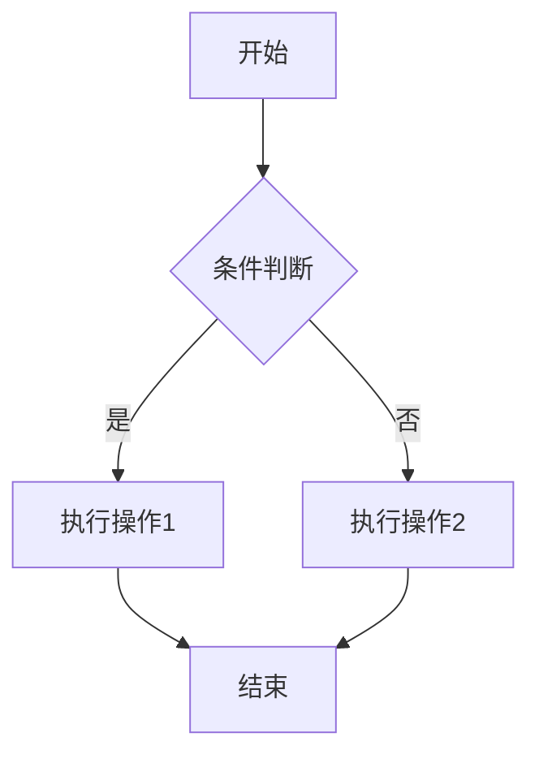
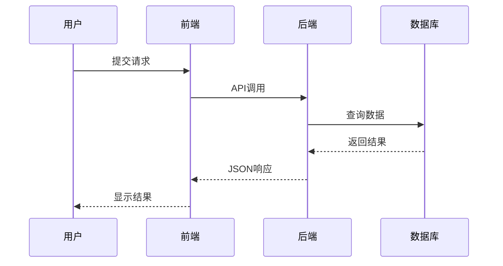
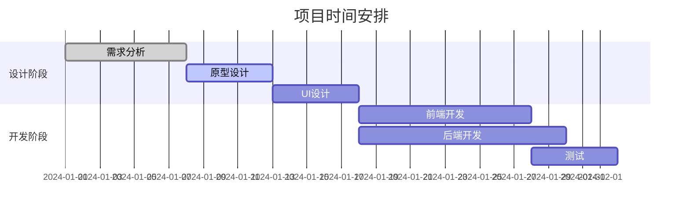
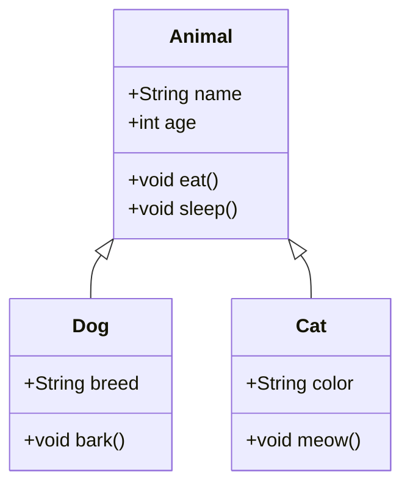
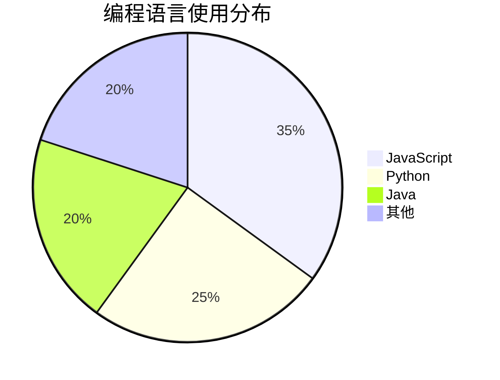

> 为了展示Markdown的各种格式，我将创建一个包含以下元素的示例：
>
> 1. 标题（多级）
> 2. 文本样式（粗体、斜体、删除线、高亮、下标、上标）
> 3. 列表（有序和无序）
> 4. 链接和图片
> 5. 表格
> 6. 代码（行内代码和代码块）
> 7. 引用
> 8. 数学公式
> 9. 水平线
> 10. 注释（HTML注释，在Markdown中通常不可见，但可以添加）
> 11. 任务列表
> 12. 脚注
> 13. 定义列表
> 14. Mermaid图表（流程图、序列图等）
>
> 注意：Typora支持大部分CommonMark和GFM（GitHub Flavored Markdown）语法，同时也支持一些扩展语法（如数学公式、Mermaid等）。但是，有些功能（如定义列表）可能不是所有Markdown解析器都支持，但Typora是支持的。
>
> 下面是一个综合示例：

# Markdown 全格式示例文档

这是一个展示 **Markdown** 几乎所有语法格式的综合性示例文档。

## 1. 标题与文本格式

### 三级标题
#### 四级标题
##### 五级标题
###### 六级标题

**这是粗体文本**  
*这是斜体文本*  
***这是粗斜体文本***  
~~这是删除线文本~~  
==这是高亮文本==  
`这是行内代码`

上标：X² + Y² = Z²  
下标：H₂O 是水的化学式

> **这是引用块**  
> 可以包含多行内容，
> 用于强调或引用他人的话语。
> — *《示例文档》*

## 2. 列表格式

### 无序列表
- 第一项
  - 嵌套子项
  - 另一个嵌套子项
- 第二项
- 第三项

### 有序列表
1. 第一步
   1. 子步骤A
   2. 子步骤B
2. 第二步
3. 第三步

### 任务列表
- [x] 已完成的任务
- [x] 未完成的任务
- [ ] 另一个待办事项

### 定义列表
术语一
: 这是术语一的定义

术语二  
: 这是术语二的定义
: 这是术语二的第二个定义

## 3. 表格

| 姓名 | 年龄 | 职业 | 评分 |
|------|------|------|------|
| 张三 | 25   | 工程师 | ⭐⭐⭐⭐ |
| 李四 | 30   | 设计师 | ⭐⭐⭐⭐⭐ |
| 王五 | 28   | 产品经理 | ⭐⭐⭐ |

**复杂表格：**

| 项目 | 第一季度 | 第二季度 | 总计 |
|------|----------|----------|------|
| 收入 | $10,000 | $12,000 | $22,000 |
| 支出 | 
  - 人力: $5,000  
  - 物料: $2,000 | 
  - 人力: $6,000  
  - 物料: $2,500 | $15,500 |
| **净利润** | **$3,000** | **$3,500** | **$6,500** |

## 4. 代码与语法高亮

### 行内代码
使用 `console.log("Hello World")` 来输出信息。

### 代码块（JavaScript）
```javascript
// 斐波那契数列生成函数
function fibonacci(n) {
  if (n <= 1) return n;
  let a = 0, b = 1;
  for (let i = 2; i <= n; i++) {
    [a, b] = [b, a + b];
  }
  return b;
}

// 使用示例
console.log(fibonacci(10)); // 输出: 55
```

### 代码块（Python）
```python
def factorial(n):
    """计算阶乘"""
    if n == 0:
        return 1
    else:
        return n * factorial(n-1)

# 列表推导式示例
squares = [x**2 for x in range(10)]
print(squares)  # [0, 1, 4, 9, 16, 25, 36, 49, 64, 81]
```

### 代码块（HTML）
```html
<!DOCTYPE html>
<html>
<head>
    <title>示例页面</title>
    <style>
        .container {
            max-width: 800px;
            margin: 0 auto;
        }
    </style>
</head>
<body>
    <div class="container">
        <h1>欢迎来到我的网站</h1>
        <p>这是一个段落。</p>
    </div>
</body>
</html>
```

## 5. 数学公式

### 行内公式
勾股定理：$a^2 + b^2 = c^2$  
欧拉公式：$e^{i\pi} + 1 = 0$

### 块级公式
二次方程求根公式：
$$
x = \frac{-b \pm \sqrt{b^2 - 4ac}}{2a}
$$

积分示例：
$$
\int_{-\infty}^{\infty} e^{-x^2} dx = \sqrt{\pi}
$$

矩阵运算：
$$
\begin{bmatrix}
1 & 2 & 3 \\
4 & 5 & 6 \\
7 & 8 & 9
\end{bmatrix}
\times
\begin{bmatrix}
a \\ b \\ c
\end{bmatrix}
=
\begin{bmatrix}
1a + 2b + 3c \\
4a + 5b + 6c \\
7a + 8b + 9c
\end{bmatrix}
$$

## 6. 图表与图形（Mermaid）

### 流程图


### 序列图


### 甘特图


### 类图


### 饼图


## 7. 诗词与文学格式

### 诗歌格式
```
《静夜思》  
床前明月光，疑是地上霜。  
举头望明月，低头思故乡。

    — 李白
```

### 分割线

---

## 8. 链接与引用

这是一个[普通链接](https://www.example.com)，这是一个[带标题的链接](https://www.example.com "示例网站")。

自动链接：https://www.markdown.org

引用式链接：这是第一个参考[^1]，这是第二个参考[^2]。

[^1]: 这是第一个脚注的内容，可以包含更详细的解释。
[^2]: 这是第二个脚注，也可以包含代码 `console.log("footnote")` 或其他格式。

## 9. 特殊符号与转义

特殊字符需要转义：\*斜体\* \*\*粗体\*\*  
版权符号：©  
注册商标：®  
商标：™  
箭头：→ ← ↑ ↓

## 10. 注释

<!-- 这是一个HTML注释，在渲染时不可见 -->

## 11. 表情符号与特殊字符

😊 🚀 ⭐ 🌟  
天气：☀️ 🌧️ ⛄  
方向：⬅️ ➡️ ⬆️ ⬇️  
符号：❤️ ★ ✰ ♻️

---

**总结**：这个文档展示了 Markdown 的丰富格式功能，包括文本格式化、列表、表格、代码、数学公式、图表、链接引用等，几乎涵盖了所有常用的语法元素。