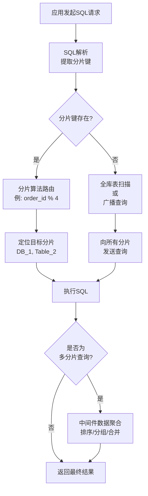

```plain text
请扮演一位资深技术面试官，我正在准备关于 {mysql} 中 `{分库分表}` 的面试。请按照以下结构化要求，为我进行全面深入的讲解：

1.  **核心概念与目标：**
    *   首先，请用一句标准的定义说明 `{分库分表}` 是什么。
    *   它的设计目标是什么？要解决的根本性问题是什么？（例如：提高吞吐量、保证数据一致性、降低延迟等）

2.  **工作原理与流程剖析：**
    *   **核心机制：** 详细阐述 `{分库分表}` 是如何工作的。请务必使用**流程图** 或 **序列图** 来描述其关键工作流程（例如：对于GC，描述对象如何被标记、回收；对于MVCC，描述ReadView如何生成和数据版本如何比较）。
    *   **关键组件/角色：** 说明在这个工作流程中，涉及哪些核心组件或概念，它们各自承担什么职责。

3.  **具体实现与技术落地：**
    *   在 `{主流技术/框架}`（例如：在HotSpot JVM中、在InnoDB引擎中）里，`{分库分表}` 是如何具体实现的？请列举2-3个关键的实现细节。
    *   为了实现该机制，系统在**性能** 或**资源** 上做出了哪些权衡（Trade-offs）？

4.  **分类、对比与选型：**
    *   `{分库分表}` 通常有哪些主流的**实现策略** 或**算法**？（例如：GC下的标记-清除、复制、G1；锁机制下的乐观锁、悲观锁）。
    *   请用**对比表格** 的形式，清晰列出这些不同策略的**工作原理**、**适用场景**、**优点** 和**缺点**。

5.  **实战场景与面试回答：**
    *   请结合一个**典型的业务场景**（例如：一个高并发的电商下单场景，或一个需要快速查询的用户中心），说明：
        *   在这个场景下，`{分库分表}` 是如何发挥作用的？
        *   如果该机制失效或配置不当，可能会引发什么**具体的生产问题**？（请用具体指标描述，如CPU飙升、RT增长、OOM等）
    *   **面试参考回答：** 请为我组织一段约3分钟的面试回答，如果被问到“请详细讲讲你对 `{分库分表}` 的理解”。回答需要涵盖上述要点，并融入您提供的典型案例，做到逻辑清晰、重点突出。
```

> 
> 我们首先明确分库分表的核心概念、目标，然后深入工作原理、实现细节、分类对比，最后结合实战场景和面试回答进行组织。
>
> 1. **核心概念与目标**
>
>    - 定义：分库分表是一种数据库水平拆分方案，通过将数据分散到多个数据库或表中，以提升系统处理大规模数据的能力。
>    - 设计目标：解决单库单表性能瓶颈、存储容量限制、高并发读写等问题，提高系统的吞吐量、可用性和扩展性。
>
> 2. **工作原理与流程剖析**
>
>    - 核心机制：分库分表通过一定的分片策略（如取模、范围等）将数据分布到不同的库或表中。应用程序通过分片键路由到具体的库表进行操作。
>    - 关键组件：
>      - 分片键（Sharding Key）：用于分片的字段，如用户ID、订单ID等。
>      - 分片算法：根据分片键计算目标库表的算法。
>      - 数据源路由：根据分片算法结果，将操作路由到对应的数据库或表。
>
>    由于文本形式，我们使用流程图描述一个查询请求的流程：
>
>    text
>
>    ```
>    开始
>    ↓
>    接收SQL请求
>    ↓
>    解析SQL，提取分片键
>    ↓
>    根据分片算法确定目标库表
>    ↓
>    执行SQL操作
>    ↓
>    返回结果
>    ↓
>    结束
>    ```
>
>    
>
> 3. **具体实现与技术落地**
>
>    - 实现细节：
>      1. 分片策略：常见的有取模分片、范围分片、哈希分片等。
>      2. 中间件：如ShardingSphere、MyCat等，它们实现了分库分表的路由和结果归并。
>      3. 分布式事务：由于跨库，需要引入分布式事务机制，如XA、TCC等。
>    - 权衡：
>      - 性能：跨库查询可能带来网络开销，需要权衡分片粒度。
>      - 一致性：分布式事务引入复杂性，可能影响性能。
>      - 开发复杂度：需要处理分片键选择、数据迁移、扩容等问题。
>
> 4. **分类、对比与选型**
>
>    - 实现策略：
>      - 垂直分片：按业务模块分库，不同业务使用不同的数据库。
>      - 水平分片：将同一表的数据按分片键分布到多个库或表中。
>    - 对比表格：
>
>    | 策略     | 工作原理                         | 适用场景               | 优点                       | 缺点                         |
>    | :------- | :------------------------------- | :--------------------- | :------------------------- | :--------------------------- |
>    | 垂直分片 | 按业务拆分，不同业务表放在不同库 | 业务模块清晰，耦合度低 | 降低单库压力，方便维护     | 跨库关联查询复杂，事务处理难 |
>    | 水平分片 | 将单表数据按规则分布到多个库表   | 单表数据量大，高并发   | 解决单表性能问题，扩展性好 | 分片键选择重要，扩容复杂     |
>
> 5. **实战场景与面试回答**
>
>    - 典型业务场景：高并发电商订单系统。订单表数据量巨大，读写频繁。
>
>      - 分库分表作用：按订单ID分片，将订单数据分散到多个库，提高读写性能，降低单表数据量。
>      - 配置不当可能问题：分片键选择不当导致数据倾斜，热点数据问题；跨库查询过多导致RT增长；分布式事务处理不当导致数据不一致。
>
>    - 面试参考回答：
>
>      面试官您好，我对分库分表的理解如下：
>
>      分库分表是一种数据库水平拆分的方案，主要用于解决单库单表在数据量巨大、高并发下的性能瓶颈和存储限制。其核心目标是通过数据分片，提升系统的吞吐量、可用性和扩展性。
>
>      分库分表的工作流程可以简单描述为：首先，应用程序发起SQL请求，中间件解析SQL并提取分片键；然后，根据预设的分片算法（如取模、范围等）确定数据所在的库和表；最后，将SQL路由到目标库表执行，并返回结果。
>
>      在具体实现上，分库分表有两种主要策略：垂直分片和水平分片。垂直分片是按业务模块拆分，将不同业务的表分布到不同的数据库，适用于业务耦合度低、模块清晰的系统。水平分片则是将单表数据按分片键分散到多个库或表中，适用于单表数据量大的场景。两种策略的对比可以参考我准备的表格。
>
>      在实际应用中，分库分表会引入一些挑战，比如跨库事务、跨库查询、分片键选择和数据迁移等。以电商订单系统为例，我们按订单ID分片，将订单数据均匀分布到多个库，这样可以提高订单的读写性能。但如果分片键选择不当，可能导致数据倾斜，比如某个分片的数据过多，形成热点，从而引发CPU飙升、RT增长等问题。另外，如果没有处理好分布式事务，可能会导致数据不一致。
>
>      因此，在采用分库分表时，需要根据业务特点谨慎选择分片键和分片策略，并考虑使用中间件来简化开发。同时，要设计好扩容方案，避免后续扩容困难。
>
>      以上就是我对分库分表的理解，谢谢。
>
> 注意：由于文本形式，流程图用文字描述，实际面试中可以画图辅助。另外，对比表格在口头回答时可以简要说明，但要有清晰的对比维度。

好的，非常荣幸能作为您的资深技术面试官，为您系统性地梳理「分库分表」这一重要主题。我将严格按照您提供的结构，结合我的经验，为您呈现一份全面、深入且易于理解的面试准备材料。

---

### **1. 核心概念与目标**

*   **一句标准的定义：**
    分库分表是一种通过将数据和负载分布到多个数据库或数据表中的数据库架构设计方法，旨在解决单一数据库在性能、容量和可用性上的瓶颈问题。

*   **设计目标与根本性问题：**
    *   **核心目标：** 提升系统的**可扩展性** 和**高并发处理能力**。
    *   **解决的根本性问题：**
        1.  **性能瓶颈：** 单一数据库的**连接数**、**CPU处理能力**、**I/O吞吐量** 是有限的。高并发场景下，大量请求竞争这些资源，导致响应时间**RT** 增长，吞吐量下降。
        2.  **存储瓶颈：** 单机**磁盘容量** 有限。当业务数据量（例如，达到亿级、十亿级）巨大时，单表数据量过大，会导致**索引深度增加**，查询性能急剧下降，同时数据备份与恢复也变得极其困难。
        3.  **可用性风险：** 单一数据库是“单点”，一旦发生故障，整个系统将不可用。

---

### **2. 工作原理与流程剖析**

*   **核心机制：**
    分库分表的核心机制是 **“数据分片”** 与 **“请求路由”** 。其工作流程可以概括为：根据预设的**分片键** 和**分片算法**，将数据均匀分布到不同的数据库或表中；当应用发起请求时，通过相同的规则定位到具体的数据源进行操作。

    以下是一个典型的 **SQL查询请求在分库分表架构下的工作流程图**：



*   **关键组件/角色：**
    *   **分片键：** 用于进行数据分片的字段，如`user_id`、`order_id`。选择是否得当直接决定数据分布是否均匀。
    *   **分片算法：** 决定数据具体落到哪个分片的规则，如取模、范围、哈希等。
    *   **分布式数据库中间件：** 这是实现分库分表的“大脑”，例如ShardingSphere、MyCat。它负责SQL解析、路由、结果归并等核心逻辑。
    *   **数据节点：** 实际的物理数据库实例。
    *   **逻辑表：** 应用程序中看到的、统一的表名，如`t_order`。
    *   **真实表：** 物理数据库中实际存在的表，如`t_order_0`, `t_order_1`, ... , `t_order_n`。

---

### **3. 具体实现与技术落地**

*   **在主流中间件（如ShardingSphere）中的关键实现细节：**
    1.  **SQL解析与路由优化：** 中间件会使用Druid等SQL解析器，将SQL抽象为语法树，精准提取分片键。对于携带分片键的查询，直接定位到单一分片；对于不携带分片键的查询，则采用广播查询或全表扫描，这需要极力避免。
    2.  **分布式主键生成：** 放弃了数据库自增ID，采用分布式ID生成算法（如Snowflake算法、Leaf），保证全局唯一、趋势递增，且避免ID冲突。
    3.  **分布式事务处理：** 这是实现中的难点。ShardingSphere支持了XA等强一致性分布式事务，但在高性能场景下，更多采用基于最终一致性的方案（如本地消息表、事务消息）。

*   **性能与资源的权衡：**
    *   **牺牲了关联查询的便利性：** 由于数据分布在多个节点，原本简单的JOIN操作变得异常复杂，甚至无法执行。**权衡** 是**用多次查询或数据冗余来换取写入和读取的性能**。
    *   **牺牲了强一致性事务的性能：** 跨分片事务需要引入复杂的分布式事务协议，性能开销大。**权衡** 是**在大部分场景下接受最终一致性，以保证系统的吞吐量和可用性**。
    *   **增加了系统复杂度：** 引入了中间件这一层，带来了额外的运维成本、网络延迟和故障点。

---

### **4. 分类、对比与选型**

*   **主流的实现策略：**
    *   **垂直分片：** 按业务维度拆分，不同业务库部署在不同数据库服务器上。
        *   **垂直分库：** 例如，将用户库、订单库、商品库分离。
        *   **垂直分表：** 将一个宽表（几十个字段）拆分成一个主表（常用字段）和多个扩展表（不常用字段）。
    *   **水平分片：** 将同一个表的数据按某种规则拆分到多个库或表中。
        *   **水平分库：** 将`user`表的数据分到`db_user_0`, `db_user_1`等多个数据库中。
        *   **水平分表：** 将`user`表的数据分到`t_user_0`, `t_user_1`等多个表中（在同一个库内）。

*   **对比表格：**

| 策略 | 工作原理 | 适用场景 | 优点 | 缺点 |
| :--- | :--- | :--- | :--- | :--- |
| **水平分库** | 按分片键和规则，将数据分布到不同**数据库** | 高并发、大数据量的单一大表 | **负载分散彻底**（连接数、CPU、IO均分散） | **跨库事务**难以处理；**架构复杂** |
| **水平分表** | 按分片键和规则，将数据分布到不同**数据表** | 单表数据量巨大，但并发未必很高 | 解决**单表数据量过大**问题，操作相对简单 | 仍共享**同一数据库**的资源（连接数、CPU） |
| **垂直分库** | 按**业务模块**将不同表拆分到不同库 | 业务耦合度低，清晰的微服务架构 | **业务解耦**，**数据库故障隔离** | 无法解决单张业务表数据量过大的问题 |
| **范围分片** | 按分片键的**范围**（如时间、ID区间）划分 | 带有时间或顺序特征的数据，方便扩容 | **易于扩容**，**区间查询高效** | **数据热点**（新数据访问频繁） |
| **哈希取模分片** | 对分片键进行Hash后取模，均匀分布 | 需要数据**绝对均匀分布**的场景 | 数据分布**均匀**，无热点 | **扩容困难**（需要数据迁移），**难以进行区间查询** |

---

### **5. 实战场景与面试回答**

*   **典型业务场景：高并发电商订单系统**
    *   **场景描述：** 一个拥有数亿用户、日均订单量千万级的电商平台。核心业务表`t_order`数据量已达数十亿，单库无法承受其写入和查询压力。
    *   **分库分表如何发挥作用：**
        1.  **选型：** 采用 **“水平分库”** 策略。
        2.  **分片键：** 选择`user_id`。因为业务查询路径大多围绕用户展开（如“我的订单”）。
        3.  **分片算法：** `user_id % 8`，将订单数据均匀分布到8个物理数据库中。
        4.  **效果：**
            *   **写入：** 每个数据库只需承担总写入量的1/8，解决了单库写入瓶颈。
            *   **查询：** 根据`user_id`查询“我的订单”时，中间件能精准路由到一个库，响应时间**RT** 从秒级降至毫秒级。
            *   **容量：** 每个库的数据量变为原来的1/8，索引效率高，存储无忧。

    *   **机制失效或配置不当的后果：**
        1.  **分片键选择不当（如用了`order_status`）：** 导致数据严重倾斜。大部分订单状态都是“已完成”，会集中在某一个分片，造成**热点**，该分片**CPU** 和**IO** 飙升，而其他分片闲置。系统整体RT增长。
        2.  **跨分片查询过多：** 后台运营系统需要全量查询订单，如果没有专门的**异构从库**，就会对所有分片进行广播查询，大量消耗数据库连接，可能引发**连接数被打满**，应用报错。
        3.  **分布式主键冲突：** 如果ID生成服务配置不当，导致ID重复，会引发**数据写入失败**等严重生产问题。

*   **面试参考回答：**

> 面试官您好，我对分库分表的理解，可以从它的核心目标、工作原理、实现策略和实战权衡这几个方面来阐述。
>
> 首先，分库分表本质上是一种“数据分片”架构，它的核心目标是解决单机数据库在**高并发吞吐量**和**海量数据存储**两个维度的瓶颈。它通过将数据和请求分散到多个数据库节点，来提升系统的整体扩展性。
>
> 其工作原理的核心是“路由”。当一个SQL请求到来时，像ShardingSphere这样的中间件会先解析它，提取出分片键（比如`user_id`），然后根据预设的分片算法（比如`user_id % 4`），将这个请求精准路由到对应的物理分片（比如`db_1`）上执行。对于跨分片的查询，中间件还需要负责将多个分片返回的结果进行聚合。
>
> 在具体实现上，主要有垂直和水平两种分片思路。垂直分库按业务拆分，比如把用户、订单拆成独立的库，实现业务解耦。而水平分库分表是解决单表问题的利器，它又可以分为范围分片和哈希分片等策略。它们各有优劣，比如哈希分片数据均匀，但扩容麻烦；范围分片扩容方便，但容易产生数据热点。在实际选型中，我们需要根据业务查询模式和数据特征来做权衡。
>
> 让我结合一个电商订单的场景来具体说明。当订单表达到数十亿行时，我们通常会选择`user_id`作为分片键进行水平分库。这样做的好处是，用户查询“我的订单”时，能直接命中一个分片，RT非常低。但如果分片键选错了，比如用了订单状态，就会导致数据严重倾斜，所有已完成订单都挤在一个库，造成那个库CPU飙升，成为性能瓶颈。此外，分库分表也带来了明显的代价，比如跨库JOIN几乎无法实现，分布式事务变得复杂，这要求我们在架构设计初期就要规避这类操作，或者通过其他手段（如数据冗余、最终一致性）来解决。
>
> 总而言之，分库分表是一把应对大数据和高并发的双刃剑。它通过牺牲单点数据库的某些特性（如便捷的关联查询和事务），换来了系统整体性能和容量的巨大提升，是分布式系统架构中非常关键的一环。
>
> 以上就是我的理解，谢谢。