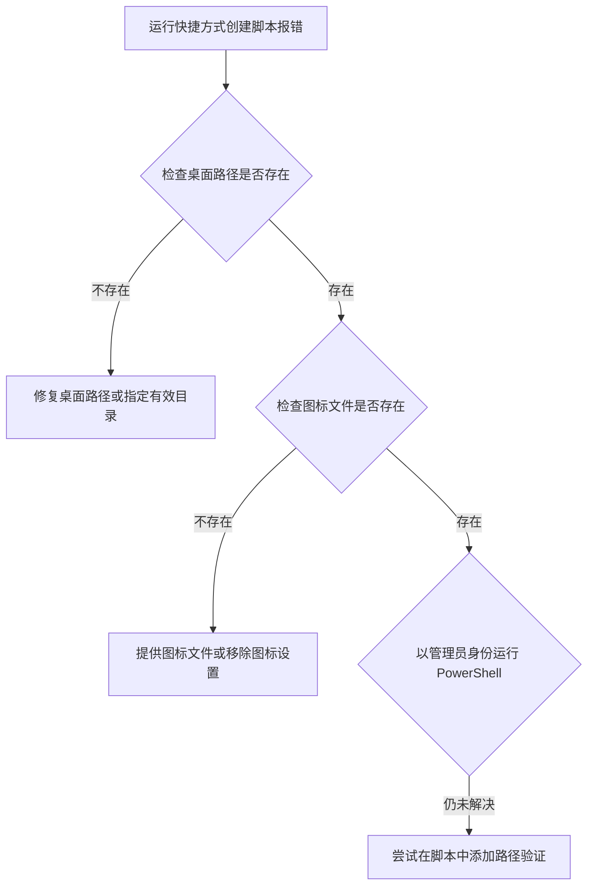

在Windows中，使用系统已有的命令为指定网址创建带有自定义图标的Google浏览器快捷方式，可以通过一些脚本工具实现。由于Windows没有直接一条命令完成所有步骤的内置工具，我们通常需要借助一些脚本方法。

下面是一个主要使用VBScript的方案，以及一个使用第三方工具（虽非严格意义上的“已有命令”，但常被用于此类任务）的备选方案。我会先用一个表格总结主要信息，然后详细说明步骤。

| 方法类型 | 所需工具/命令 | 优点 | 缺点 | 图标设置 |
| :--- | :--- | :--- | :--- | :--- |
| **VBScript** | `WScript.Shell` COM对象 | 无需额外软件，系统原生支持 | 命令稍长，需注意参数格式 | 在脚本中指定，创建后即生效 |
| **第三方工具** | `shortcut.exe` | 功能强大，参数直观 | 需单独下载此工具 | 在命令中直接指定 |

### 🖥️ 方法一：使用VBScript（系统内置支持）

VBScript可以通过`WScript.Shell` COM对象来创建和配置快捷方式，这是Windows系统原生支持的。

1.  **打开文本编辑器**：
    按下 `Win + R`，输入 `notepad` 并回车，打开记事本。

2.  **编写VBScript脚本**：
    将以下代码复制到记事本中。请务必将 `TargetPath` 和 `IconLocation` 中的路径替换为你自己电脑上Chrome浏览器的实际安装路径（如果不同的话），`IconLocation` 也可以指向你的 `c:\icon.ico` 文件。

    ```vb
    Set WshShell = WScript.CreateObject("WScript.Shell")
    strDesktop = WshShell.SpecialFolders("Desktop")
    Set oShellLink = WshShell.CreateShortcut(strDesktop & "\RanTools Website.lnk")
    oShellLink.TargetPath = "C:\Program Files\Google\Chrome\Application\chrome.exe"
    oShellLink.Arguments = "https://tools.ranblogs.com/"
    oShellLink.WindowStyle = 3
    oShellLink.IconLocation = "c:\icon.ico, 0"
    oShellLink.Description = "Open RanTools Website in Chrome"
    oShellLink.WorkingDirectory = "C:\Program Files\Google\Chrome\Application"
    oShellLink.Save
    WScript.Echo "Shortcut created successfully!"
    ```

    **参数解释**：
    *   `TargetPath`: 指定Google Chrome浏览器的可执行文件（`chrome.exe`）的完整路径。
    *   `Arguments`: 指定要打开的网址，即 `https://tools.ranblogs.com/`。
    *   `WindowStyle`: 设置窗口状态，`3` 表示最大化窗口。
    *   `IconLocation`: 指定快捷方式图标的路径。这里的 `c:\icon.ico` 是你的图标文件，`, 0` 表示使用该文件中的第一个图标。
    *   `WorkingDirectory`: 设置工作目录，通常是Chrome的安装目录。

3.  **保存并运行脚本**：
    *   将文件保存到桌面，文件名可以设为 `create_shortcut.vbs`，确保保存类型为“所有文件”，编码为ANSI。
    *   双击保存好的 `.vbs` 文件运行它。如果一切正常，会弹出一个提示框告诉你快捷方式创建成功。此时，桌面上应该会出现一个名为“RanTools Website”的快捷方式。

### 📥 方法二：使用第三方命令行工具Shortcut.exe

`shortcut.exe` 是一个小巧的免费命令行工具，由OptimumX开发，它可以更方便地通过命令行创建快捷方式。**注意：此工具非Windows自带，需单独下载**。

1.  **下载shortcut.exe**：
    你需要先从这个工具的主页（例如在OptimumX官网）下载它，并将其放置在一个合适的目录，或者和你的批处理脚本放在同一目录下。

2.  **编写批处理脚本**：
    创建一个新的文本文件，将以下命令复制进去。同样，请确保Chrome的路径和图标路径正确。

    ```bat
    shortcut /F:"%USERPROFILE%\Desktop\RanTools Website.lnk" /A:C /T:"C:\Program Files\Google\Chrome\Application\chrome.exe" /P:"https://tools.ranblogs.com/" /I:"c:\icon.ico" /R:3 /D:"Open RanTools Website in Chrome"
    ```

    **参数解释**（参考自）：
    *   `/F:`: 指定要创建的快捷方式文件的完整路径。
    *   `/A:C`: 执行创建（Create）操作。
    *   `/T:`: 指定目标程序路径。
    *   `/P:`: 指定传递给目标程序的参数（即网址）。
    *   `/I:`: 指定图标文件的位置。
    *   `/R:3`: 设置运行方式为最大化窗口（3=Maximized）。
    *   `/D:`: 设置快捷方式的描述信息。

3.  **保存并运行批处理文件**：
    *   将文件保存为 `create_shortcut.bat`，保存类型为“所有文件”。
    *   双击运行这个批处理文件，它便会调用 `shortcut.exe` 在桌面创建指定的快捷方式。

### ⚠️ 图标设置注意事项

*   **图标格式**：Windows 的快捷方式通常支持 `.ico` 格式的图标文件。如果你的图标是其他格式（如PNG、JPG），可能需要先转换为 `.ico` 格式。许多在线工具或简单的图像处理软件（如GIMP、GIMP）都可以完成这个转换。
*   **图标未生效**：如果创建完成后发现图标没有变化，可以尝试**手动刷新桌面**（按F5）或**手动指定图标**：
    *   右键点击生成的快捷方式，选择“**属性**”。
    *   在“**快捷方式**”选项卡中，点击“**更改图标...**”按钮。
    *   在打开的窗口中，点击“**浏览...**”，然后找到并选择你的 `c:\icon.ico` 文件。
    *   点击“确定”保存更改。

### 💎 总结

VBScript 脚本利用了系统内置的 COM 组件，是“借用”系统已有能力完成任务的方式。而 Shortcut.exe 是一个专门为此目的设计的强大第三方命令行工具，使用起来更直接。

希望这些方法能帮你成功创建需要的快捷方式。如果在尝试过程中遇到问题，或者图标显示不正常，不妨尝试一下手动更改图标的方法。

# 问题排除
你遇到的这个“System.IO.DirectoryNotFoundException”错误，通常是因为 PowerShell 无法在指定的路径中找到**父目录**（也就是快捷方式文件想要保存的那个文件夹），或者你没有足够的权限在该位置写入文件。

虽然你定义的 `$shortcutPath` 是桌面路径，但系统依然报错目录找不到。我们可以一步步排查问题。

### 🔍 排查步骤

首先，让我们检查最可能出问题的环节。下面是一个流程图，帮助你快速理解和定位问题：



#### 1. 检查桌面路径是否存在

首先，**手动验证**你的桌面路径是否真的存在。在PowerShell中逐行运行以下命令：

```powershell
# 检查桌面路径是否可用
Test-Path -Path $env:USERPROFILE\Desktop
```

如果返回 `False`，说明你的系统可能修改了桌面路径（例如，通过组策略或重定向），或者当前用户配置文件有问题。你可以通过 `echo $env:USERPROFILE` 查看用户主目录具体路径，并使用 `[Environment]::GetFolderPath("Desktop")` 这个.NET方法获取系统认可的桌面路径，这个方法通常更可靠。

```powershell
# 使用 .NET 方法获取准确的桌面路径
$desktopPath = [Environment]::GetFolderPath("Desktop")
$shortcutPath = "$desktopPath\RanblogsTool.lnk"
Write-Host "桌面路径确定为: $desktopPath"
```

#### 2. 检查图标文件是否存在

错误虽然提示的是目录未找到，但如果 `$iconPath`（`C:\icon.ico`）指定的图标文件不存在，在某些情况下也可能引发问题。请确认这个文件是否真实存在于C盘根目录下。

```powershell
# 检查图标文件是否存在
if (Test-Path -Path $iconPath) {
    Write-Host "图标文件找到啦。"
} else {
    Write-Host "警告：在 $iconPath 未找到图标文件。这可能会是问题之一。"
}
```

如果文件不存在，你需要提供一个有效的 `.ico` 文件，或者暂时注释掉设置图标的那行代码（`$Shortcut.IconLocation = ...`）来测试是否是图标导致的问题。

#### 3. 以管理员身份运行 PowerShell

尽管是向用户桌面创建快捷方式，但如果你在**系统受保护的目录**（如 `C:\Windows\System32`）下运行脚本，或者系统权限设置非常严格，可能会遇到写入限制。**以管理员身份运行PowerShell**可以消除权限不足的疑虑。

具体操作方法是：
1.  在开始菜单或搜索栏中查找“PowerShell”。
2.  右键单击“Windows PowerShell”。
3.  选择“**以管理员身份运行**”。
4.  然后在打开的新窗口中再次运行你的脚本。

#### 4. 在脚本中添加路径验证

在尝试保存快捷方式之前，先确认其父目录是否存在，如果不存在则创建它。这是一个良好的编程习惯，能避免很多问题。

```powershell
# 提取快捷方式文件的父目录（例如 C:\Users\Lenovo\Desktop）
$shortcutDirectory = Split-Path -Path $shortcutPath -Parent

# 检查该目录是否存在，如果不存在则创建它
if (-not (Test-Path -Path $shortcutDirectory)) {
    Write-Host "目录 $shortcutDirectory 不存在，现在创建它。"
    New-Item -ItemType Directory -Path $shortcutDirectory -Force
} else {
    Write-Host "目录 $shortcutDirectory 已存在。"
}
```

将这段代码添加到你的原始脚本中 `$Shortcut.Save()` 之前。

### ✅ 修正后的脚本参考

结合以上排查点，这是一个修正后的、更健壮的脚本范例：

```powershell
# 定义路径变量（请按实际修改）
$chromePath = "C:\Program Files\Google\Chrome\Application\chrome.exe" # 注意默认通常是Program Files
$url = "https://tools.ranblogs.com/"
$iconPath = "C:\icon.ico"

# 使用 .NET 方法可靠地获取桌面路径
$desktopPath = [Environment]::GetFolderPath("Desktop")
$shortcutPath = "$desktopPath\RanblogsTool.lnk"

# 确保快捷方式所在目录存在
$shortcutDirectory = Split-Path -Path $shortcutPath -Parent
if (-not (Test-Path -Path $shortcutDirectory)) {
    New-Item -ItemType Directory -Path $shortcutDirectory -Force
}

# 检查Chrome路径是否存在（可选但推荐）
if (-not (Test-Path -Path $chromePath)) {
    Write-Warning "在 $chromePath 未找到Chrome浏览器，请检查路径是否正确。"
}

# 创建快捷方式对象
$WshShell = New-Object -ComObject WScript.Shell
$Shortcut = $WshShell.CreateShortcut($shortcutPath)
$Shortcut.TargetPath = $chromePath
$Shortcut.Arguments = "--new-window `"$url`"" # 强制新窗口打开

# 只有图标文件存在时才设置图标
if (Test-Path -Path $iconPath) {
    $Shortcut.IconLocation = "$iconPath, 0"
} else {
    Write-Warning "图标文件 $iconPath 不存在，快捷方式将使用默认图标。"
}

# 尝试保存快捷方式
try {
    $Shortcut.Save()
    Write-Host "快捷方式创建成功: $shortcutPath"
} catch {
    Write-Error "保存快捷方式时出错: $($_.Exception.Message)"
}
```

### 💎 如果问题依旧

如果尝试了所有方法后问题仍然存在，可以考虑：
*   暂时**禁用杀毒软件或实时防护**（有时它们会阻止脚本创建可执行文件的快捷方式），但完成后请记得重新开启。
*   在**另一个位置**（如你的用户文档文件夹）创建快捷方式，测试是否是桌面本身的问题。
    ```powershell
    $shortcutPath = "$env:USERPROFILE\Documents\RanblogsTool.lnk"
    ```

希望这些步骤能帮你解决问题。如果仍然报错，请提供更多关于你的系统环境的信息，例如是否使用了特殊的用户权限管理或文件夹重定向策略。
