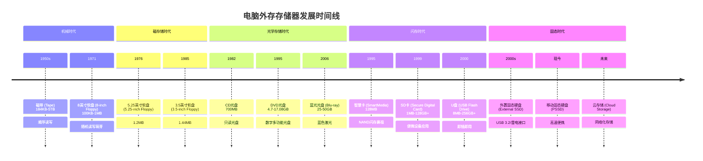

电脑外存存储器的发展堪称科技领域一场静默却影响深远的革命。从缓慢笨重的机械装置到今日的高速便携设备，其演进历程值得探讨。下面我将为你详细介绍电脑外存存储器的发展史、当前主流产品的比较以及不同场景下的选购建议。

# 🖥️ 电脑外存存储器发展史与选购指南

## 电脑外存存储器发展历程

外存存储器的发展，堪称计算技术史上一条波澜壮阔的支流。它从物理穿孔的“刚性”记忆，逐步演化为我们手中轻盈却海量的“数字记忆体”，其历程不仅反映了存储技术的根本性突破，也见证了计算机从专用大型设备向个人化、移动化转变的历史。

为了让你更直观地把握这场跨越百年的存储技术演进，我将关键的发展阶段和代表性设备整理成了一张时间线图：

## 二、详解代表性外存存储器

### 1. 穿孔卡片 (Punched Card)
-   **时间**：1900-1950年代
-   **容量**：约**960 bits**（按典型的80列×12行霍勒瑞斯卡计算）
-   **技术特点**：通过在有特定位置的方孔或矩形孔来表示信息（数据或指令），是一种**机械式二进制存储**（有孔表“1”，无孔表“0”）。
-   **用途**：最早用于纺织业（约1725年），后广泛应用于**早期计算机的数据输入和存储**，如IBM的制表机。
-   **读写速度**：极慢，完全依赖读卡机的机械速度。
-   **可写次数/寿命**：**理论上可无限读取**（但物理磨损不可避免），**写入一次**（打孔后无法更改）。

### 2. 磁带 (Magnetic Tape)
-   **时间**：1950年代至今
-   **容量**：从**184KB** (UNIVAC I, 1951) 发展到现代 **5TB+**
-   **技术特点**：在一条柔软的塑料带子上涂覆磁性材料，通过磁头的电磁感应来**顺序读写**数据。
-   **用途**：早期计算机的主要外存，至今仍在**海量冷数据备份**和**归档**领域不可替代（如科研机构、大型企业）。
-   **读写速度**：顺序读写速度可非常快（现代磁带库），但**随机访问极慢**（需要倒带）。
-   **可写次数/寿命**：可重复读写，次数可达数千次，寿命可达数十年（需妥善保存）。

### 3. 软盘 (Floppy Disk)
-   **时间**：
    -   8英寸：1971-1979
    -   5.25英寸：1976-1982
    -   3.5英寸：1985-2005
-   **容量**：从 **100KB** (8英寸) 到 **1.44MB** (3.5英寸成为主流)
-   **技术特点**：在柔性圆形薄膜上涂覆磁性材料，封装于保护壳中，通过软驱磁头**随机读写**。
-   **用途**：**个人电脑软件分发、数据交换和个人数据存储**的主要媒介（在光盘和网络普及前）。
-   **读写速度**：慢（约**100KB/s**量级）。
-   **可写次数/寿命**：可重复读写，次数有限（磁性衰减或物理损伤）。

### 4. 光盘 (Optical Disc)
-   **时间**：
    -   CD: 1982年至今
    -   DVD: 1995年至今
    -   Blu-ray: 2006年至今
-   **容量**：
    -   CD: **700MB**
    -   DVD: **4.7GB - 17.08GB**
    -   BD: **25GB - 50GB** (单层/双层)
-   **技术特点**：利用**激光**烧蚀（或改变）盘片上的染料（CD-R, DVD-R）或相变材料（DVD-RW, BD-RE）来记录数据，通过激光反射读取。
-   **用途**：**软件、音乐、电影发行，数据备份和归档**。
-   **读写速度**：CD-ROM的150KB/s为1倍速，后来发展到52倍速；DVD和BD的速度也以此为基础倍增。
-   **可写次数/寿命**：
    -   **ROM** (只读): 无限读取。
    -   **R** (一次性写入): 写入一次，读取多次。
    -   **RW/RE** (可擦写): 可重复读写数百至数千次。
    -   寿命通常可达数十年（避免刮擦和光照）。

### 5. 闪存设备 (Flash Memory Devices)
-   **时间**：
    -   智慧卡 (SmartMedia): 1995-2004
    -   SD卡: 1999年至今
    -   U盘: 2000年至今
-   **容量**：从早期**几MB** (如U盘初期8MB) 发展到如今**数TB** (SDXC, U盘)
-   **技术特点**：采用**浮栅MOS晶体管**存储电荷（表示0和1），**非易失性**、**无机械部件**、**抗震动**。
    -   **NAND Flash**是上述设备的基础。
    -   **U盘** (USB Flash Drive) 将NAND闪存芯片与USB接口控制器集成。
-   **用途**：**数码相机、手机、平板电脑、便携式音乐播放器**等消费电子产品的存储，以及**便捷的数据移动存储**。
-   **读写速度**：早期慢，现在受**接口（USB, SD总线）和闪存性能**影响大。现代U盘（USB 3.2 Gen 1）可达**100-500MB/s**，高速SD卡（UHS-II, UHS-III）甚至更快。
-   **可写次数/寿命**：**有限制**（P/E周期）。SLC > MLC > TLC > QLC。现代TLC/QLC通过磨损均衡等技术，普通用户难以用尽寿命。
-   **技术演进**：制程工艺从微米到纳米，堆叠层数从2D到3D NAND（如长江存储232层3D TLC颗粒），容量大增，成本大降。

### 6. 硬盘驱动器 (HDD) 与 固态硬盘 (SSD)
-   **HDD时间**：1956年至今（IBM第一款HDD RAMAC 350）
-   **SSD时间**：作为外置存储广泛应用在2000年后
-   **容量**：
    -   HDD: 从**5MB** (1956) 到现今**20TB+**
    -   SSD: 从几十GB到现今**数TB**（外置移动SSD常见1TB-4TB）
-   **技术特点**：
    -   **HDD**: 利用**磁头**在高速旋转的**磁性盘片**上读写数据，**机械式**。
    -   **SSD**: 基于**NAND闪存**（类似U盘，但通常性能更强，结构更复杂），**全电子式**。
-   **用途**：计算机的**主要内部存储**，也作为**外置移动存储**（移动硬盘/移动SSD）。
-   **读写速度**：
    -   **HDD**: 慢（**100-200MB/s**量级），受转速（5400/7200rpm）和接口（SATA）限制。
    -   **SSD**: 快很多。外置移动SSD速度受接口影响：
        -   USB 3.2 Gen 1 (5Gbps): 约 **500MB/s**
        -   USB 3.2 Gen 2 (10Gbps): 约 **1000MB/s**
        -   USB 3.2 Gen 2x2 (20Gbps)/雷电3: 约 **2000MB/s+**
-   **可写次数/寿命**：
    -   **HDD**: 理论可无限次读写，但**机械结构有磨损**，平均无故障时间（MTBF）通常为百万小时级。
    -   **SSD**: 同闪存，有**P/E周期限制**，但通常以**TBW**（终生写入字节数）衡量，对于消费级产品足够用多年。
-   **外置形式**：移动硬盘（HDD外置）、移动固态硬盘（PSSD）。

## 三、主流外部存储器全方位比较

了解了历史后，我们来看看当前市场上的主流外部存储器及其特点。现代外存的选择主要集中在**移动固态硬盘（PSSD）**、**移动机械硬盘（HDD）**、**U盘**和**存储卡**。

下面这个表格对比了四类主流外部存储器的核心特性，希望能帮助你快速了解它们的差异。

| 特性维度         | 移动固态硬盘 (PSSD)                       | 移动机械硬盘 (移动HDD)                 | U盘 (USB Flash Drive)                 | 存储卡 (Memory Card)                 |
| :--------------- | :---------------------------------------- | :------------------------------------- | :------------------------------------ | :----------------------------------- |
| **核心原理**     | NAND闪存芯片，无机械部件            | 磁性盘片，机械磁头读写           | NAND闪存芯片，集成控制器              | NAND闪存芯片                         |
| **最大容量**     | **~4TB** (常见)                           | **~5TB** (常见，桌面式更大)            | **~1TB** (常见)                       | **~1TB** (常见)                      |
| **传输速度**     | **高速**: 500MB/s - 2000MB/s+ | **慢速**: 100-200MB/s            | **中速**: 100MB/s - 400MB/s     | **中高速**: 90MB/s - 300MB/s         |
| **体积重量**     | 较小较轻 (如名片大小，30g-100g)      | 较大较重 (需考虑震动)                  | **极小极轻** (便携性极致)             | **极小极轻** (为设备设计)            |
| **抗震抗摔**     | **极高** (无机械结构)                | **差** (怕震动、撞击)            | **高**                                | **高**                               |
| **功耗**         | 较低                                      | 较高 (需驱动电机)                      | **极低**                              | **极低**                             |
| **价格(元/GB)**  | **较高** (约0.5-1.2元/GB)                 | **低** (约0.2-0.4元/GB)          | 中等 (约0.4-0.8元/GB)                 | 中等 (约0.4-0.8元/GB)                |
| **主要优势**     | **速度、耐用性、抗震性**                    | **大容量、低成本**                     | **极致便携、即插即用**                | **专为移动设备设计**                 |
| **主要劣势**     | 价格较高                                  | 速度慢、怕震动、噪音发热较大           | 容量相对较小，持续传输性能可能不如SSD | 需读卡器，易丢失                     |
| **典型应用场景** | 系统备份、大型文件传输、视频编辑、游戏库 | **冷数据备份**、海量资料归档     | **小文件频繁交换**、系统安装盘        | **数码相机**、手机、无人机、行车记录仪 |

## 四、按应用场景推荐外存选择

了解了各类存储器的特性后，关键是根据自己的实际需求来做选择。以下是针对不同用户群体的外存选购建议，包括品牌和规模的考量。

### 1. 学生群体
-   **需求特点**：**预算敏感**、存储课件、文档、照片、游戏，需要兼顾**便携性**和一定的容量。
-   **推荐选择**：
    -   **首选 (性价比之选)**：**512GB - 1TB 的移动固态硬盘 (PSSD)**。例如**爱国者(aigo)**、**梵想(Fanxiang)**、**移速(MOVE SPEED)** 等品牌的入门级或主流型号。这些国产品牌提供了非常好的性价比，速度远快于U盘和HDD，足够学生使用。
    -   **备用选择**：**大容量、高速U盘 (256GB-512GB)**。如果预算更有限，或者只是用来拷贝文档和PPT，一款读写速度在150MB/s以上的U盘（如爱国者U353）也很方便。
    -   **品牌规模建议**：国产品牌如**爱国者、朗科、台电、梵想、移速**等，提供了大量**100-500元**价位的高性价比PSSD和U盘，品质可靠，保修政策通常为3年左右。

### 2. 普通家庭/个人用户
-   **需求特点**：**照片、视频备份**，存放影视资源，可能需要在电视、电脑等多种设备上使用。
-   **推荐选择**：
    -   **首选 (海量存储)**：**2TB - 5TB 的移动机械硬盘 (HDD)**。例如**希捷(Seagate) Backup Plus睿翼**或**西部数据(WD) My Passport**系列。容量大，成本低，适合做家庭照片库和影视资源库。
    -   **备用选择 (快速访问)**：**1TB 移动固态硬盘 (PSSD)**。如果你经常访问和编辑家庭视频、照片，希望速度快一些，PSSD体验更好。例如**三星(Samsung) T7**、**闪迪(SanDisk) E81**或国产品牌如**小米**。
    -   **品牌规模建议**：**希捷、西部数据**是HDD领域的国际巨头，产品线丰富，品质和售后有保障。PSSD可选国际大牌（三星、闪迪）或国产主流品牌（小米、联想、爱国者）。

### 3. 企业/公司用户
-   **需求特点**：**数据安全性和可靠性**是第一位的，可能需要**硬件加密**功能，大量数据交换、备份，多人协作。
-   **推荐选择**：
    -   **首选 (安全与效率)**：**带有硬件加密功能的移动固态硬盘**。例如**爱国者S10**（支持指纹加密）、**西部数字WD My Passport Ultra**系列（通常带加密软件）。对于需要频繁携带公司数据出差的员工，PSSD的高速度和抗摔性是刚需。
    -   **批量存储/归档**：**企业级NAS或多盘位硬盘盒+大容量HDD**。对于部门级别的海量数据归档，组建NAS系统或使用大型桌面硬盘（如**希捷Expansion**、**WD My Book**）更经济。
    -   **品牌规模建议**：国际品牌如**三星、西部数据、闪迪**在商务领域有良好口碑和可靠的保修服务。**联想、爱国者**等也提供了商务安全系列。企业采购应更关注品牌的**售后服务**（如是否提供上门换修）和**数据恢复服务**（如希捷睿翼提供一次免费原厂数据恢复）。

### 4. 创意专业人士/AI开发者
-   **需求特点**：处理**超大文件**（4K/8K视频、大型数据集、3D模型），对**传输速度极端敏感**，需要**高可靠性**。
-   **推荐选择**：
    -   **首选 (极致性能)**：**高性能NVMe移动固态硬盘**。支持**USB 3.2 Gen 2x2 (20Gbps)** 或**雷电3/4 (40Gbps)** 接口的PSSD是必须的。例如**闪迪至尊超极速E81**（2000MB/s）、**三星T9**、**雷孜(LaCie) Rugged SSD Pro**。这些硬盘能极大提升视频渲染、模型加载的效率。
    -   **AI数据存储**：**大容量（4TB+）高性能PSSD或高速桌面SSD+硬盘盒**，用于存放和快速读取训练数据集。
    -   **品牌规模建议**：追求顶级性能和可靠性，预算充足，可选择**闪迪、三星、雷孜**等品牌的高端系列。也可自行选择**西部数据、希捷**的高性能NVMe SSD搭配优质硬盘盒。

### 5. 政府机构/网络中心
-   **需求特点**：**数据安全、自主可控**（尤其政府部门），**长期稳定的保修和支持**，**大规模采购**的性价比和一致性。
-   **推荐选择**：
    -   **首选 (安全与可控)**：优先选用**国产知名品牌**的存储产品。例如**长江存储**致态系列、**华为**存储、**大唐存储**以及其他与国产化平台适配良好的国产品牌。这对于数据安全和供应链安全至关重要。
    -   **海量数据备份**：**磁带库**或**专用归档硬盘**。对于需要**几十年长期保存**的冷数据，磁带依然是成本最低、最可靠的选择。或者采用多套HDD阵列进行异地备份。
    -   **品牌规模建议**：**长江存储**是国内闪存芯片的龙头企业，其自有品牌致态产品力优秀。**华为**在企业级存储解决方案方面实力雄厚。政府采购通常会倾向于国产化品牌名单内的产品。

### 6. 学校/教育机构
-   **需求特点**：**需要兼顾成本与管理**，机房维护、教学资源分发、学生作业收集，设备需要**耐用皮实**。
-   **推荐选择**：
    -   **机房/教学**：**耐用型U盘或移动硬盘**。可以考虑**联想ZX1**（双接口，兼容性好）等带有**防震、防水**特性的产品，毕竟公用设备损耗较大。
    -   **资源库备份**：**大容量移动HDD或NAS**。用于存储教学视频、软件镜像等。
    -   **品牌规模建议**：**联想、台电、朗科**等品牌经常有教育采购套餐，价格优惠，保修渠道稳定。

希望这份详细的指南能帮助你做出明智的选择。记住，**没有最好的存储设备，只有最适合你需求的存储设备**。